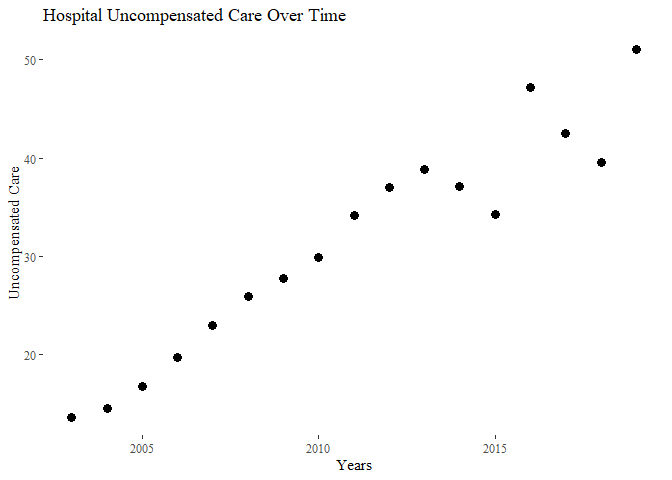
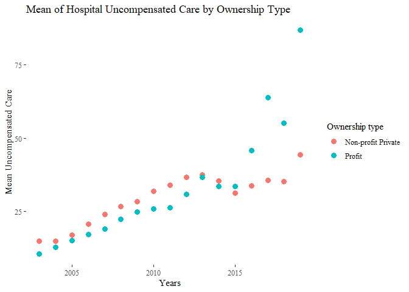
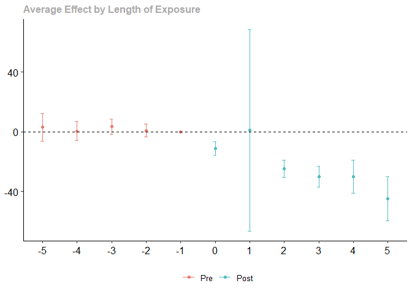
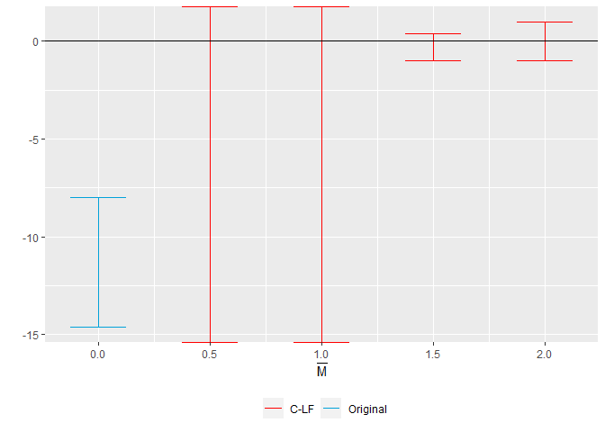

Assignment1
================
Jung Jae Kim

## Merging the data

``` r
# Focus on the years from 2003 through 2019
data_hcris <- data_hcris %>% filter(year>=2003 & year<=2019)
data_pos <- data_pos %>% filter(year>=2003 & year<=2019)

# Adjust dollar unit to the million
data_hcris <- data_hcris %>%
  mutate(provider = provider_number) %>%
  mutate(uncomp_care = uncomp_care / 1000000) %>%
  mutate(tot_pat_rev = tot_pat_rev / 1000000)

# Change the state name to abbreviation
data_aca <- data_aca %>%
  mutate(state = c(state.abb,'DC')[match(State,
                                         c(state.name,'District of Columbia'))],
         year_adopted = format(as.Date(data_aca$date_adopted), format="%Y")) %>%
  select(state, year_adopted, expanded)

data_merged <- data_hcris %>% 
  mutate(provider=as.character(provider),
         year=as.double(year)) %>% 
  inner_join(data_pos, by=c('provider','year')) %>%
  mutate(year=as.numeric(year),
         state = state.x) %>%
  left_join(data_aca, by='state')
```

# Questions

1.  Provide and discuss a table of simple summary statistics showing the
    mean, standard deviation, min, and max of hospital total revenues
    and uncompensated care over time.

``` r
table1 <- data_merged %>%
  group_by(year) %>%
  summarise_at(c('tot_pat_rev', 'uncomp_care'),list(mean = mean, sd = sd, min = min, max = max), na.rm=T) %>%
  relocate("year",starts_with("tot"), starts_with("unc"))
table1
```

    # A tibble: 17 × 9
        year tot_pat_rev…¹ tot_p…² tot_pa…³ tot_p…⁴ uncom…⁵ uncom…⁶ uncomp…⁷ uncom…⁸
       <dbl>         <dbl>   <dbl>    <dbl>   <dbl>   <dbl>   <dbl>    <dbl>   <dbl>
     1  2003          184.    329. -1.76e+0   4723.    13.6    32.3 -1.28e-1    778.
     2  2004          203.    368.  1.54e-1   5526.    14.5    32.2  1   e-6    684.
     3  2005          222.    408.  1   e-6   6399.    16.7    32.0  1   e-6    428.
     4  2006          246.    451. -1.04e-1   7784.    19.7    35.0  3.65e-4    379.
     5  2007          268.    494.  6.36e-2   8577.    22.9    44.9  1   e-6    736.
     6  2008          292.    541.  4   e-6   9294.    25.8    50.0  3.04e-3    993.
     7  2009          320.    596.  1.19e-1   9846.    27.7    48.8  1   e-5    584.
     8  2010          343.    640.  3.07e-1  10185.    29.8    75.6  1   e-6   2794.
     9  2011          368.    689. -2.76e+1  10572.    34.2    77.9 -1.72e+1   2058.
    10  2012          391.    741. -1.18e+1  11865.    37.0    89.2 -1.24e+0   1881.
    11  2013          413.    798.  9.49e-2  12752.    38.8    82.8 -1.19e-1   1812.
    12  2014          445.    860.  6.62e-3  13376.    37.1    92.4  1.04e-2   1990.
    13  2015          485.    931.  9.37e-3  14144.    34.2    91.0 -5.29e-1   2037.
    14  2016          526.   1018.  8.50e-2  15619.    47.2   432.  -3.64e-2  20404.
    15  2017          566.   1122.  1.25e-1  16863.    42.5   108.  -2.80e-2   2747.
    16  2018          613.   1241.  2.83e-1  18677.    39.5   105.   9.09e-3   2597.
    17  2019          665.   1372.  3   e-6  22001.    51.0   128.  -9.78e+1   2639.
    # … with abbreviated variable names ¹​tot_pat_rev_mean, ²​tot_pat_rev_sd,
    #   ³​tot_pat_rev_min, ⁴​tot_pat_rev_max, ⁵​uncomp_care_mean, ⁶​uncomp_care_sd,
    #   ⁷​uncomp_care_min, ⁸​uncomp_care_max

2.  Create a figure showing the mean hospital uncompensated care from
    2003 to 2019. Show this trend separately by hospital ownership type
    (private not for profit and private for profit).

``` r
plot1 <- table1 %>% ggplot(aes(x = year, y = uncomp_care_mean, group=year)) +
  geom_point(size=3) + 
  theme_tufte() +
  labs(x="Years", y="Uncompensated Care", 
       title = "Hospital Uncompensated Care Over Time")
plot1
```

<!-- -->

``` r
plot2 <- data_merged %>%
  filter((own_type == "Non-profit Private" | own_type == "Profit")) %>%
  group_by(year,own_type) %>%
  summarise_at(c('uncomp_care'),list(uncomp_care_mean=mean),na.rm=T) %>%
  ggplot(aes(x=year, y=uncomp_care_mean, color=own_type)) +
  geom_point(size = 3) +
  theme_tufte()+ 
  labs(x="Years", y="Mean Uncompensated Care", 
       title = "Mean of Hospital Uncompensated Care by Ownership Type", 
       fill = "Ownership type", color = "Ownership type")
plot2
```

<!-- -->

``` r
### Evidence of extreme Outliers, are those misstipying> should I removed them? Ask.
```

3.  Using a simple DD identification strategy, estimate the effect of
    Medicaid expansion on hospital uncompensated care using a
    traditional two-way fixed effects (TWFE) estimation: where
    $D_{it}=1(E_{i}\leq t)$ in Equation @ref(eq:dd) is an indicator set
    to 1 when a hospital is in a state that expanded as of year $t$ or
    earlier, $\gamma_{t}$ denotes time fixed effects, $\alpha_{i}$
    denotes hospital fixed effects, and $y_{it}$ denotes the hospital’s
    amount of uncompensated care in year $t$. Present four estimates
    from this estimation in a table: one based on the full sample
    (regardless of treatment timing); one when limiting to the 2014
    treatment group (with never treated as the control group); one when
    limiting to the 2015 treatment group (with never treated as the
    control group); and one when limiting to the 2016 treatment group
    (with never treated as the control group). Briefly explain any
    differences.

``` r
result = list()
for(i in 1:4){
  if (i == 1){
    data_DiD <- data_merged %>%
      filter(!is.na(uncomp_care)) %>%
      select(provider,year,state,uncomp_care,expanded,year_adopted) %>%
      mutate(treatment = ifelse(expanded == TRUE & year >= year_adopted, 1, 0))
    result[[i]] = felm(formula = uncomp_care ~ treatment | provider + year | 0 | provider, data = data_DiD)
  }
    
  else{
  data_DiD <- data_merged %>%
    filter(!is.na(uncomp_care)) %>%
    filter(expanded == FALSE | year_adopted==i+2012) %>%
    select(provider,year,state,uncomp_care,expanded,year_adopted) %>%
    mutate(treatment = ifelse(expanded == TRUE & year >= year_adopted, 1, 0))
  result[[i]] = felm(formula = uncomp_care ~ treatment | provider + year | 0 | provider, data = data_DiD)
  }
}

stargazer(result[1],result[2],result[3],result[4], type='text', note="(1)-(4) representes full, 2014 group, 2015 group and 2016 group respectevely")
```


    =====================================================================================================
                                                       Dependent variable:                               
                        ---------------------------------------------------------------------------------
                                                           uncomp_care                                   
                                (1)                  (2)                 (3)                  (4)        
    -----------------------------------------------------------------------------------------------------
    treatment                -31.353***          -38.359***           -37.782***          -39.504***     
                              (2.816)              (3.857)             (5.077)              (4.329)      
                                                                                                         
    -----------------------------------------------------------------------------------------------------
    Observations               36,515              27,789               16,301              14,822       
    R2                         0.366                0.696               0.338                0.681       
    Adjusted R2                0.277                0.654               0.247                0.636       
    Residual Std. Error 111.984 (df = 32060) 49.334 (df = 24427) 165.405 (df = 14333) 64.002 (df = 12988)
    =====================================================================================================
    Note:                                                                     *p<0.1; **p<0.05; ***p<0.01

    ============================================================================
    (1)-(4) representes full, 2014 group, 2015 group and 2016 group respectevely
    ----------------------------------------------------------------------------

4.  Estimate an “event study” version of the specification in part 3:
    where $D_{it}^{\tau} = 1(t-E_{i}=\tau)$ in Equation @ref(eq:event)
    is essentially an interaction between the treatment dummy and a
    relative time dummy. In this notation and context, $\tau$ denotes
    years relative to Medicaid expansion, so that $\tau=-1$ denotes the
    year before a state expanded Medicaid, $\tau=0$ denotes the year of
    expansion, etc. Estimate with two different samples: one based on
    the full sample and one based only on those that expanded in 2014
    (with never treated as the control group).

``` r
result_event = list()
for(i in 1:2){
  if (i==1){
    data_event <- data_merged %>%
      filter(!is.na(uncomp_care)) %>%
      select(provider,year,state,uncomp_care,expanded,year_adopted) %>%
      mutate(relative_year = ifelse(expanded == FALSE, 0 ,year-as.numeric(year_adopted)),
             treated_ever = ifelse(expanded == TRUE, 1, 0))
    result_event[[i]] = feols(uncomp_care~i(relative_year,treated_ever,ref=-1) | provider+year, cluster=~provider, data=data_event)
  }
  
  else{
    data_event <- data_merged %>%
      filter(!is.na(uncomp_care)) %>%
      filter(expanded == FALSE | year_adopted==i+2012) %>%
      select(provider,year,state,uncomp_care,expanded,year_adopted) %>%
      mutate(relative_year = ifelse(expanded == FALSE, 0 ,year-as.numeric(year_adopted)),
             treated_ever = ifelse(expanded == TRUE, 1, 0))
    result_event[[i]] = feols(uncomp_care~i(relative_year,treated_ever,ref=-1) | provider+year, cluster=~provider, data=data_event)
  }
}
```

    NOTE: 24 observations removed because of NA values (RHS: 24).

``` r
modelsummary(result_event,stars=TRUE,output='markdown')
```

|                                    |    Model 1    |    Model 2    |
|:-----------------------------------|:-------------:|:-------------:|
| relative_year = -18 × treated_ever | 42.184\*\*\*  |               |
|                                    |    (8.263)    |               |
| relative_year = -17 × treated_ever | 38.022\*\*\*  |               |
|                                    |    (6.935)    |               |
| relative_year = -16 × treated_ever | 33.227\*\*\*  |               |
|                                    |    (6.585)    |               |
| relative_year = -15 × treated_ever | 31.126\*\*\*  |               |
|                                    |    (6.403)    |               |
| relative_year = -14 × treated_ever | 30.810\*\*\*  |               |
|                                    |    (6.417)    |               |
| relative_year = -13 × treated_ever | 31.248\*\*\*  |               |
|                                    |    (5.956)    |               |
| relative_year = -12 × treated_ever | 28.502\*\*\*  |               |
|                                    |    (5.360)    |               |
| relative_year = -11 × treated_ever | 23.401\*\*\*  | 18.799\*\*\*  |
|                                    |    (4.321)    |    (3.981)    |
| relative_year = -10 × treated_ever | 20.242\*\*\*  | 16.684\*\*\*  |
|                                    |    (3.869)    |    (3.544)    |
| relative_year = -9 × treated_ever  | 18.709\*\*\*  | 16.846\*\*\*  |
|                                    |    (3.665)    |    (3.529)    |
| relative_year = -8 × treated_ever  | 17.508\*\*\*  | 16.883\*\*\*  |
|                                    |    (3.697)    |    (4.412)    |
| relative_year = -7 × treated_ever  | 15.125\*\*\*  | 16.397\*\*\*  |
|                                    |    (3.589)    |    (4.634)    |
| relative_year = -6 × treated_ever  | 14.333\*\*\*  |  13.013\*\*   |
|                                    |    (3.206)    |    (4.589)    |
| relative_year = -5 × treated_ever  | 12.753\*\*\*  |    9.286\*    |
|                                    |    (3.495)    |    (4.149)    |
| relative_year = -4 × treated_ever  |    6.237\*    |    8.591\*    |
|                                    |    (2.777)    |    (3.814)    |
| relative_year = -3 × treated_ever  |    4.341\*    |   8.300\*\*   |
|                                    |    (2.171)    |    (2.796)    |
| relative_year = -2 × treated_ever  |     1.288     |     1.986     |
|                                    |    (1.148)    |    (2.228)    |
| relative_year = 0 × treated_ever   |  -14.275\*\*  | -11.567\*\*\* |
|                                    |    (4.743)    |    (2.380)    |
| relative_year = 1 × treated_ever   |     0.372     | -16.883\*\*\* |
|                                    |   (19.370)    |    (2.227)    |
| relative_year = 2 × treated_ever   |  -41.302\*\*  | -28.343\*\*\* |
|                                    |   (13.192)    |    (2.731)    |
| relative_year = 3 × treated_ever   | -40.332\*\*\* | -37.833\*\*\* |
|                                    |    (5.459)    |    (3.275)    |
| relative_year = 4 × treated_ever   | -44.578\*\*\* | -39.446\*\*\* |
|                                    |    (6.856)    |    (3.874)    |
| relative_year = 5 × treated_ever   | -44.590\*\*\* | -53.883\*\*\* |
|                                    |    (5.360)    |    (5.220)    |
| Num.Obs.                           |     36515     |     27789     |
| AIC                                |   443359.7    |   291733.5    |
| BIC                                |   443563.8    |   291873.4    |
| RMSE                               |    104.72     |     46.04     |
| Std.Errors                         | by: provider  | by: provider  |
| FE: provider                       |       X       |       X       |
| FE: year                           |       X       |       X       |

**Note:** ^^ + p \< 0.1, \* p \< 0.05, \*\* p \< 0.01, \*\*\* p \< 0.001

5.  Sun and Abraham (SA) show that the $\delta_{\tau}$ coefficients in
    Equation @ref(eq:event) can be written as a non-convex average of
    all other group-time specific average treatment effects. They
    propose an interaction weighted specification: Re-estimate your
    event study using the SA specification in Equation @ref(eq:iwevent).
    Show your results for $\hat{\delta}_{e, \tau}$ in a Table, focusing
    on states with $E_{i}=2014$, $E_{i}=2015$, and $E_{i}=2016$.

``` r
##### Differential timgin treatment
data_SA <- data_merged %>%
    filter(!is.na(uncomp_care)) %>%
    select(provider,year,state,uncomp_care,expanded,year_adopted) %>%
    mutate(expand_year = ifelse(expanded == FALSE, 10000, as.numeric(year_adopted)),
           time_to_treat = ifelse(expanded == FALSE, -1 ,year-expand_year),
           time_to_treat = ifelse(time_to_treat < -5,-5, time_to_treat)
           )
result_SA <- feols(uncomp_care~sunab(expand_year, time_to_treat, no_agg=TRUE) | provider+year, cluster=~provider, data=data_SA)
```

    NOTE: 24 observations removed because of NA values (RHS: 24).

``` r
modelsummary(result_SA, stars = TRUE, output = "markdown")
```

|                                    |    Model 1    |
|:-----------------------------------|:-------------:|
| time_to_treat = -5 × cohort = 2014 | 11.564\*\*\*  |
|                                    |    (3.189)    |
| time_to_treat = -5 × cohort = 2015 | 16.539\*\*\*  |
|                                    |    (4.555)    |
| time_to_treat = -5 × cohort = 2016 |    10.263+    |
|                                    |    (5.767)    |
| time_to_treat = -5 × cohort = 2019 | 22.961\*\*\*  |
|                                    |    (6.602)    |
| time_to_treat = -4 × cohort = 2014 |    6.231+     |
|                                    |    (3.364)    |
| time_to_treat = -4 × cohort = 2015 |     3.927     |
|                                    |    (4.066)    |
| time_to_treat = -4 × cohort = 2016 |    -2.906     |
|                                    |    (4.035)    |
| time_to_treat = -4 × cohort = 2019 | 18.573\*\*\*  |
|                                    |    (4.451)    |
| time_to_treat = -3 × cohort = 2014 |   6.855\*\*   |
|                                    |    (2.112)    |
| time_to_treat = -3 × cohort = 2015 |   5.588\*\*   |
|                                    |    (2.142)    |
| time_to_treat = -3 × cohort = 2016 |    -3.301     |
|                                    |    (3.566)    |
| time_to_treat = -3 × cohort = 2019 |   10.015\*    |
|                                    |    (4.876)    |
| time_to_treat = -2 × cohort = 2014 |     1.628     |
|                                    |    (1.656)    |
| time_to_treat = -2 × cohort = 2015 |     2.898     |
|                                    |    (2.388)    |
| time_to_treat = -2 × cohort = 2016 |    -2.386     |
|                                    |    (2.553)    |
| time_to_treat = -2 × cohort = 2019 |     7.378     |
|                                    |    (4.990)    |
| time_to_treat = 0 × cohort = 2014  | -11.174\*\*\* |
|                                    |    (1.843)    |
| time_to_treat = 0 × cohort = 2015  |    -27.850    |
|                                    |   (26.397)    |
| time_to_treat = 0 × cohort = 2016  | -11.509\*\*\* |
|                                    |    (2.589)    |
| time_to_treat = 0 × cohort = 2019  | -21.068\*\*\* |
|                                    |    (3.424)    |
| time_to_treat = 1 × cohort = 2014  | -16.814\*\*\* |
|                                    |    (1.926)    |
| time_to_treat = 1 × cohort = 2015  |    83.473     |
|                                    |   (99.267)    |
| time_to_treat = 1 × cohort = 2016  | -34.806\*\*\* |
|                                    |    (4.593)    |
| time_to_treat = 2 × cohort = 2014  | -27.071\*\*\* |
|                                    |    (2.331)    |
| time_to_treat = 2 × cohort = 2015  |   -52.939\*   |
|                                    |   (25.993)    |
| time_to_treat = 2 × cohort = 2016  | -36.587\*\*\* |
|                                    |    (4.829)    |
| time_to_treat = 3 × cohort = 2014  | -34.788\*\*\* |
|                                    |    (2.745)    |
| time_to_treat = 3 × cohort = 2015  |   -64.208+    |
|                                    |   (33.113)    |
| time_to_treat = 3 × cohort = 2016  | -51.826\*\*\* |
|                                    |    (5.550)    |
| time_to_treat = 4 × cohort = 2014  | -36.538\*\*\* |
|                                    |    (3.350)    |
| time_to_treat = 4 × cohort = 2015  |   -80.837\*   |
|                                    |   (39.217)    |
| time_to_treat = 5 × cohort = 2014  | -48.430\*\*\* |
|                                    |    (4.535)    |
| Num.Obs.                           |     36515     |
| AIC                                |   443269.3    |
| BIC                                |   443549.9    |
| RMSE                               |    104.57     |
| Std.Errors                         | by: provider  |
| FE: provider                       |       X       |
| FE: year                           |       X       |

**Note:** ^^ + p \< 0.1, \* p \< 0.05, \*\* p \< 0.01, \*\*\* p \< 0.001

6.  Present an event study graph based on the results in part 5. Hint:
    you can do this automatically in `R` with the `fixest` package
    (using the `sunab` syntax for interactions), or with
    `eventstudyinteract` in `Stata`. These packages help to avoid
    mistakes compared to doing the tables/figures manually and also help
    to get the standard errors correct.

``` r
coefplot(result_SA, main="Effect of Medicaid Eaxpansion on Uncompensated Care")
```

<!-- -->

7.  Callaway and Sant’Anna (CS) offer a non-parametric solution that
    effectively calculates a set of group-time specific differences,
    $ATT(g,t)= E[y_{it}(g) - y_{it}(\infty) | G_{i}=g]$, where $g$
    reflects treatment timing and $t$ denotes time. They show that under
    the standard DD assumptions of parallel trends and no anticipation,
    $ATT(g,t) = E[y_{it} - y_{i, g-1} | G_{i}=g] - E[y_{it} - y_{i,g-1} | G_{i} = \infty]$,
    so that $\hat{ATT}(g,t)$ is directly estimable from sample analogs.
    CS also propose aggregations of $\hat{ATT}(g,t)$ to form an overall
    ATT or a time-specific ATT (e.g., ATTs for $\tau$ periods
    before/after treatment). With this framework in mind, provide an
    alternative event study using the CS estimator. Hint: check out the
    `did` package in `R` or the `csdid` package in `Stata`.

``` r
data_CS <- data_merged %>%
  filter(!is.na(uncomp_care)) %>%
  select(provider,year,state,uncomp_care,expanded,year_adopted) %>%
  mutate(expand_year = ifelse(expanded == FALSE, 0, as.numeric(year_adopted))) %>%
  group_by(provider) %>%
  mutate(provider_id=cur_group_id()) %>% ungroup()


result_CS <- att_gt(yname="uncomp_care", 
                 tname="year", 
                 idname="provider_id",
                 gname="expand_year",
                 data=data_CS, 
                 panel=TRUE, 
                 est_method="dr",
                 allow_unbalanced_panel=TRUE,
                 base_period="universal")

result_CS_event <- aggte(result_CS, type="dynamic", min_e = -5, max_e = 5)
result_CS_event
```


    Call:
    aggte(MP = result_CS, type = "dynamic", min_e = -5, max_e = 5)

    Reference: Callaway, Brantly and Pedro H.C. Sant'Anna.  "Difference-in-Differences with Multiple Time Periods." Journal of Econometrics, Vol. 225, No. 2, pp. 200-230, 2021. <https://doi.org/10.1016/j.jeconom.2020.12.001>, <https://arxiv.org/abs/1803.09015> 


    Overall summary of ATT's based on event-study/dynamic aggregation:  
         ATT    Std. Error     [ 95%  Conf. Int.]  
     -23.332        4.3822    -31.921    -14.7431 *


    Dynamic Effects:
     Event time Estimate Std. Error [95% Simult.  Conf. Band]  
             -5   2.9710     3.5871       -6.3170     12.2590  
             -4   0.3875     2.4600       -5.9821      6.7571  
             -3   3.4720     1.9890       -1.6781      8.6221  
             -2   0.8815     1.6633       -3.4251      5.1881  
             -1   0.0000         NA            NA          NA  
              0 -11.3077     1.7639      -15.8749     -6.7405 *
              1   0.9236    26.0367      -66.4919     68.3391  
              2 -24.7646     2.2379      -30.5590    -18.9702 *
              3 -30.1446     2.6798      -37.0833    -23.2059 *
              4 -30.0599     4.2059      -40.9499    -19.1698 *
              5 -44.6390     5.6828      -59.3533    -29.9247 *
    ---
    Signif. codes: `*' confidence band does not cover 0

    Control Group:  Never Treated,  Anticipation Periods:  0
    Estimation Method:  Doubly Robust

``` r
ggdid(result_CS_event)
```

<!-- -->

8.  Rambachan and Roth (RR) show that traditional tests of parallel
    pre-trends may be underpowered, and they provide an alternative
    estimator that essentially bounds the treatment effects by the size
    of an assumed violation in parallel trends. One such bound RR
    propose is to limit the post-treatment violation of parallel trends
    to be no worse than some multiple of the pre-treatment violation of
    parallel trends. Assuming linear trends, such a violation is
    reflected by

$$ 
\Delta(\bar{M}) = { \delta : \forall t \geq 0, \lvert (\delta_{t+1} - \delta_{t}) - (\delta_{t} - \delta_{t-1}) \rvert \leq \bar{M} \times \max_{s<0} \lvert (\delta_{s+1} - \delta_{s}) - (\delta_{s} - \delta_{s-1}) \rvert }.
$$

Using the `HonestDiD` package in `R` or `Stata`, present a sensitivity
plot of your CS ATT estimates using $\bar{M} = \{0, 0.5, 1, 1.5, 2\}$.
Check out the GitHub repo [here](https://github.com/pedrohcgs/CS_RR) for
some help in combining the `HonestDiD` package with CS estimates.

``` r
# Install some packages
library(HonestDiD)
## -----------------------------------------------------------------------------
#' @title honest_did
#'
#' @description a function to compute a sensitivity analysis
#'  using the approach of Rambachan and Roth (2021)
#' @param es an event study
honest_did <- function(es, ...) {
  UseMethod("honest_did", es)
}
#' @title honest_did.AGGTEobj
#'
#' @description a function to compute a sensitivity analysis
#'  using the approach of Rambachan and Roth (2021) when
#'  the event study is estimating using the `did` package
#'
#' @param e event time to compute the sensitivity analysis for.
#'  The default value is `e=0` corresponding to the "on impact"
#'  effect of participating in the treatment.
#' @param type Options are "smoothness" (which conducts a
#'  sensitivity analysis allowing for violations of linear trends
#'  in pre-treatment periods) or "relative_magnitude" (which
#'  conducts a sensitivity analysis based on the relative magnitudes
#'  of deviations from parallel trends in pre-treatment periods).
#' @inheritParams HonestDiD::createSensitivityResults
#' @inheritParams HonestDid::createSensitivityResults_relativeMagnitudes
honest_did.AGGTEobj <- function(es,
                                e=0,
                                type=c("smoothness", "relative_magnitude"),
                                method=NULL,
                                bound="deviation from parallel trends",
                                Mvec=NULL,
                                Mbarvec=NULL,
                                monotonicityDirection=NULL,
                                biasDirection=NULL,
                                alpha=0.05,
                                parallel=FALSE,
                                gridPoints=10^3,
                                grid.ub=NA,
                                grid.lb=NA,
                                ...) {
  
  
  type <- type[1]
  
  # make sure that user is passing in an event study
  if (es$type != "dynamic") {
    stop("need to pass in an event study")
  }
  
  # check if used universal base period and warn otherwise
  if (es$DIDparams$base_period != "universal") {
    warning("it is recommended to use a universal base period for honest_did")
  }
  
  # recover influence function for event study estimates
  es_inf_func <- es$inf.function$dynamic.inf.func.e
  
  # recover variance-covariance matrix
  n <- nrow(es_inf_func)
  V <- t(es_inf_func) %*% es_inf_func / (n*n) 
  
  
  nperiods <- nrow(V)
  npre <- sum(1*(es$egt < 0))
  npost <- nperiods - npre
  
  baseVec1 <- basisVector(index=(e+1),size=npost)
  
  orig_ci <- constructOriginalCS(betahat = es$att.egt,
                                 sigma = V, numPrePeriods = npre,
                                 numPostPeriods = npost,
                                 l_vec = baseVec1)
  
  if (type=="relative_magnitude") {
    if (is.null(method)) method <- "C-LF"
    robust_ci <- createSensitivityResults_relativeMagnitudes(betahat = es$att.egt, sigma = V, 
                                                             numPrePeriods = npre, 
                                                             numPostPeriods = npost,
                                                             bound=bound,
                                                             method=method,
                                                             l_vec = baseVec1,
                                                             Mbarvec = Mbarvec,
                                                             monotonicityDirection=monotonicityDirection,
                                                             biasDirection=biasDirection,
                                                             alpha=alpha,
                                                             gridPoints=100,
                                                             grid.lb=-1,
                                                             grid.ub=1,
                                                             parallel=parallel
                                                             )
    
  } else if (type=="smoothness") {
    robust_ci <- createSensitivityResults(betahat = es$att.egt,
                                          sigma = V, 
                                          numPrePeriods = npre, 
                                          numPostPeriods = npost,
                                          method=method,
                                          l_vec = baseVec1,
                                          monotonicityDirection=monotonicityDirection,
                                          biasDirection=biasDirection,
                                          alpha=alpha,
                                          parallel=parallel, 
                                          Mvec=Mvec)
  }
  
  list(robust_ci=robust_ci, orig_ci=orig_ci, type=type)
}
```

``` r
sensitivity_results <-
  honest_did.AGGTEobj(result_CS_event,
                      e =0,
                      type = "relative_magnitude",
                      Mbarvec = seq(from = 0.5, to = 2, by = 0.5))
HonestDiD::createSensitivityPlot_relativeMagnitudes(sensitivity_results$robust_ci,
                                                    sensitivity_results$orig_ci)
```

<!-- -->

9.  Discuss your findings and compare estimates from different
    estimators (e.g., are your results sensitive to different
    specifications or estimators? Are your results sensitive to
    violation of parallel trends assumptions?).

10. Reflect on this assignment. What did you find most challenging? What
    did you find most surprising?
